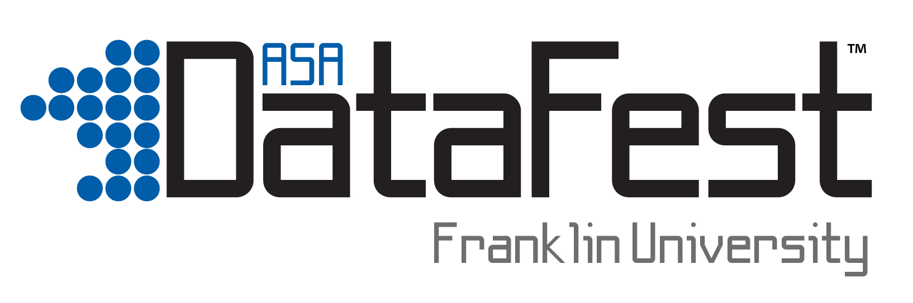

    

        
    

    <h1>ASA DataFest 2025</h1>
    
A celebration of data analytics where students work with real-world data to solve complex problems.

    

        <a href="https://forms.gle/R3YvkfzgD7714vQ79" class="button">Register Now</a>
        <a href="faq/" class="button" style="background: transparent; border: 2px solid white;">Learn More</a>
    

    

        

            <h3>Event Details</h3>
            <ul>
                <li><strong>Dates:</strong> April 25–27, 2025</li>
                <li><strong>Format:</strong> Virtual</li>
                <li><strong>Registration Deadline:</strong> April 4, 2025</li>
                <li><strong>Kick-off:</strong> Friday, April 25 at 5pm</li>
                <li><strong>Final Presentation Submissions:</strong> Sunday, April 25</li>
                <li><strong>Pre-event workshop:</strong>
                    <ul>
                        <li>Workshop 1: Excel Analytics Essentials on April 11, 2025, at 7 PM EST</li>
                        <li>Workshop 2: Python Analytics Essentials on April 18, 2025, at 7 PM EST</li>
                        <li>Workshop 3: R Analytics Essentials Studio on April 21, 2025, at 7 PM EST</li>
                    </ul>
                    <li><i>You are expected to attend at least two of them to be qualified to attend the event.</i></li>
                </li>
            </ul>
        

        

            <h3>Who Can Participate?</h3>
            <ul>
                <li>Undergraduate students from any major</li>
                <li>Master's degree students in the following programs: Master of Science in Communications, Master of Science in Professional Sales Leadership, Master of Science in Health Informatics, Master of Business Administration - STEM, Master of Science in Information Technology, Master of Science in Computer Science, Master of Business Administration, Master of Science in Business Analytics, Master of Science in Data Analytics, Master of Science in Information Systems, Data Analytics Graduate Certificate</li>
                <li>Teams of 2-5 students</li>
                <li>No prior data analysis experience required</li>
                <li>All skill levels welcome</li>
            </ul>
        

        

            <h3>What You'll Get</h3>
            <ul>
                <li>Real-world data analysis experience</li>
                <li>Mentorship from industry professionals</li>
                <li>Networking opportunities</li>
                <li>Chance to win prizes: Best in Show, Best Visualization, with Franklin University Badge </li>
                <li>One year membership to The American Statistical Association (ASA)</li>
            </ul>
        

    

    <h2>About ASA DataFest</h2>
    
The American Statistical Association (ASA) DataFest is a celebration of data where teams of students work around the clock to analyze a complex, real-world dataset. Students use their creativity and analytical skills to discover and communicate insights from the data.

    
    
Teams will be guided by roving mentors who are faculty members or industry professionals. Many professionals find ASA DataFest to be a great recruiting opportunity–they get to watch and support talented undergraduate students work under pressure in a team setting.

    <h2>Competition Format</h2>
    

        

            <h3>Day 1: Kick-off</h3>
            
Teams receive the surprise dataset and begin their analysis journey. The data is always interesting and comes from a real-world client.

        

        

            <h3>Day 2: Analysis</h3>
            
Full day of data wrangling, analysis, and visualization. Mentors are available to guide teams through challenges.

        

        

            <h3>Day 3: Presentation Submission</h3>
            
Teams prepare and deliver their findings to a panel of judges. Each team has a few minutes video recording and two slides to impress the judges with their best insights.

        

    

    <h2>Tools & Technology</h2>
    
Students can use any tools they prefer for data analysis, including:

    

        

            <h3>Data Analysis</h3>
            <ul>
                <li>Microsoft Excel, Power Query</li>
                <li>Python</li>
                <li>R</li>
            </ul>
        

        

            <h3>Visualization</h3>
            <ul>
                <li>Microsoft Excel</li>
                <li>Power BI</li>
                <li>Tableau</li>
            </ul>
        

    

    <h2>Ready to Join?</h2>
    

        
Registration is open until April 4, 2025. Don't have a team? No problem! We'll help match you with other participants.

        <a href="https://forms.gle/R3YvkfzgD7714vQ79" class="button">Register for DataFest 2025</a>
    

    
Want to see what DataFest is like? <a href="http://datafest.stat.ucla.edu/past-datafests">Check out past DataFest events</a> or <a href="/post-events">view our past winners</a>.
 